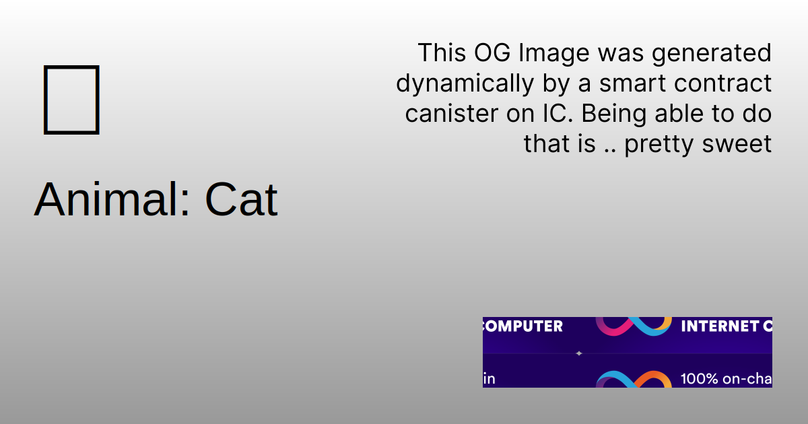

# IC OG image generation

Smart contract canisters on the Internet Computer can serve content over HTTPS. That means whole websites can be hosted on the IC. This project demonstrates how to **dynamically generate Open Graph images** for an IC project. It also shows how to **dynamically modify the HTML metadata** of each page to improve SEO.

The demo is called "Animals". It is a simple website that displays a list of animals. Each animal has its own page with a unique Open Graph image and metadata.

> [!TIP]
> See the live demo: [https://2lv2n-giaaa-aaaal-qjuda-cai.icp0.io](https://2lv2n-giaaa-aaaal-qjuda-cai.icp0.io)

Example generated Open Graph image:



## Project Structure

The project consists of two packages;

## 1. [`animals_frontend`](./packages/animals_frontend)

The frontend is a Vite/React app that interacts with the backend canister to fetch the list of animals and display them on the website. It also fetches the Open Graph image and metadata for each animal.

## 2. [`animals_canister`](./packages/animals_canister)

The backend is a Rust canister that serves frontend assets and provides an API to fetch the list of animals, Open Graph images, and metadata.

## Run locally

Before you get started, make sure you have `dfx` installed. You can find instructions on how to install `dfx` [here](https://internetcomputer.org/docs/current/developer-docs/build/install-upgrade-remove).

### 1. Start the local replica

```bash
dfx start --clean
```

### 2. Deploy the canisters

```bash
make deploy
```

## How does the Open Graph image generation work?

In short, this is how the Open Graph image generation works:

1. The user requests the detail page for an animal, for example, url `/1`, with `1` being the ID of the animal.
2. The `http_request` service endpoint of the backend canister is being called with a query.
3. The first time this url is requested, `http_request` is unable to directly serve the request because the requested assets does not yet exist. `http_request` returns a 404 status code and at the same time asks the IC boundary node to "retry/upgrade" the request, this time as an update request.
4. A new request is made, this time to the `http_request_update` service endpoint. The request now being an update request means the canister can generate the Open Graph image and store it as an asset.
5. In addition to generating the Open Graph image, the canister also generates the HTML metadata for the page. Both these assets are stored as certified assets in the canister's memory so they can be served directly by the `http_request` service endpoint in the future.

## More information

Learn more about how the Internet Computer [certifies assets and serves them over HTTPS](https://internetcomputer.org/docs/current/tutorials/developer-journey/level-3/3.3-certified-data/).

More information about the [Open Graph protocol](https://ogp.me/).

## Author

- [kristofer@kristoferlund.se](mailto:kristofer@kristoferlund.se)
- Twitter: [@kristoferlund](https://twitter.com/kristoferlund)
- Discord: kristoferkristofer
- Telegram: [@kristoferkristofer](https://t.me/kristoferkristofer)

## License

This project is licensed under the MIT License. See the LICENSE file for more details.
